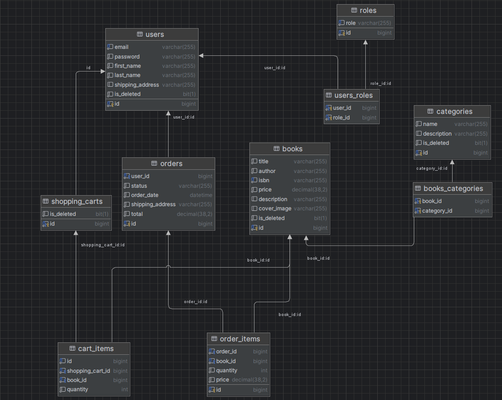
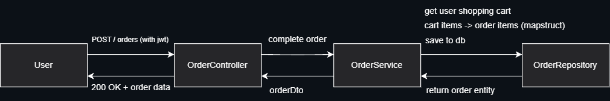

# 📚 Online Book Store Application

[](https://www.oracle.com/java/technologies/javase/jdk21-archive-downloads.html)
[](https://www.liquibase.com/)
[](https://spring.io/projects/spring-boot)
[](https://www.mysql.com/)
[](https://junit.org/)
[](https://testcontainers.com/?language=java)
[](https://swagger.io/)
[](https://www.docker.com/)

---

## 🔖 Sections :
<details> 

<summary>click to expand</summary>

- [📖 Introduction](#Introduction)
- [🛠️ Technology Stack](#Technology-stack)
- [💻 API Controllers Overview](#API-Controllers-Overview)
- [🗂️ Database Schema Overview](#Database-Schema-Overview)
- [🏗️ Project Architecture](#Project-Architecture)
- [🚀 Getting Started](#Getting-Started)
- [🔧 Manual Setup (Without Docker)](#manual-setup-without-docker)

</details>

---

## 📖 Introduction
**Online Book Store** is a Spring Boot backend application, designed to solve critical challenges in digital book retail: 
fragmented inventory management, insecure transactions, and poor scalability. Inspired by the growing demand for accessible reading resources, 
this project delivers a unified platform with secure user authentication, real-time inventory tracking,
and user-friendly shopping operations—all built on Java 21 and cloud-ready architecture. It bridges the gap between readers and retailers, 
transforming how books are discovered, purchased, and managed.

---

## 🛠️ Technology Stack
Online Book Store API leverages a cutting-edge, cloud-ready stack to ensure scalability, security, and developer efficiency:

### Core Frameworks

**Java 21 🪙:** Modern language features (records, pattern matching).

**Spring Boot 3 🌱:** Rapid development with auto-configuration.

**Spring Web 🌐:** RESTful API design with MVC architecture.

**Spring Data JPA 💾:** Simplified database operations via ORM.

**Spring Security 🛡️:** End-to-end authentication/authorization.

**JWT 🔐:** Secure token-based user sessions.

### Database & Infrastructure

**MySQL 🐬:** Relational data storage

**Liquibase 📜:** Version-controlled database migrations.

**Docker 🐳:** Containerized environment consistency.

**AWS ☁️:**

- **EC2:** App deployment.

- **RDS:** Managed MySQL instances.

- **IAM:** Secure access policies.

- **ECR:** Docker image registry.

### Development & Testing

**MapStruct ⚙️:** Automated DTO-entity mapping.

**JUnit 5 🧪 + TestContainers 📦:** Integration tests with real DB instances.

**Maven 🗃️:** Build automation and dependency management.

**Swagger 📊** - Interactive API documentation.

---

## 💻 API Controllers Overview

Online Book Store API features a structured RESTful architecture with secure, role-based endpoints.

> ⚠️ All endpoints are prefixed with `/api` for consistent routing.

### 🔐 Authentication Controller (`/auth`)
**User Registration** (`POST /registration`):

Creates a new user account. Returns UserResponseDto with status 201 CREATED.

**User Login** (`POST /login`):

Authenticates users. Returns JWT token in UserLoginResponseDto.

### 📖 Book Controller (`/books`)

> ⚠️ Requires USER role for reads, ADMIN for writes.

**Book Management:**

`GET /`: Fetch all books (paginated/sorted).

`GET /{id}`: Retrieve a book by ID.

`GET /search`: Search books by title/author/price.

**Admin-Only Operations:**

`POST /`: Create a new book (201 CREATED).

`PUT /{id}`: Update a book by ID.

`DELETE /{id}`: Delete a book (204 NO_CONTENT).

### 🗂️ Category Controller (/categories)

> ⚠️ Requires USER role for reads, ADMIN for writes.

**Category Operations:**

`GET /`: List all categories (paginated/sorted).

`GET /{id}`: Get category by ID.

`GET /{id}/books`: Fetch books in a category.

**Admin-Only Actions:**

`POST /`: Create category (201 CREATED).

`PUT /{id}`: Update category.

`DELETE /{id}`: Delete category (204 NO_CONTENT).

### 🛒 Shopping Cart Controller (/cart)

> ⚠️ Requires USER role.

**Cart Operations:**

`GET /`: Retrieve user's cart.

`POST /`: Add book to cart.

`PUT /{id}`: Update cart item quantity.

`DELETE /{id}`: Remove cart item (204 NO_CONTENT).

### 📦 Order Controller (/orders)

**User Actions:**

`POST /`: Place order from cart.

`GET /`: View order history (paginated).

`GET /{orderId}/items`: Fetch items in an order.

`GET /{orderId}/items/{itemId}`: Get specific order item.

**Admin Action:**

`PATCH /{orderId}`: Update order status (e.g., PENDING → DELIVERED).

---

## 🗂️ Database Schema Overview



### 📊 Core Entities
- **users**

    - Stores user credentials, roles, and personal details.

    - Linked to: `shopping_carts`, `orders`.

    - Roles: `USER`, `ADMIN` (via `roles` table).

- **books**

    - Contains book details: `title`, `author`, `price`, `isbn`, etc.

    - Many-to-Many with categories via `books_categories`.

- **categories**

    - Hierarchical book categorization (e.g., Fiction, Tech).
    
    - Self-referencing for subcategories (optional).

- **shopping_carts**

    - Unique per user.
    
    - Holds `cart_items` with `book_id`, `quantity`.

- **orders & order_items**

    - `orders`: User, status (`PENDING`, `DELIVERED`, etc.), total.
    
    - `order_items`: Snapshot of book/quantity/price at purchase.

- **roles**

    - Defines access levels: `ROLE_USER`, `ROLE_ADMIN`.

---

## 🏗️ Project Architecture

The backend follows a layered Spring Boot architecture:

**1. Controller Layer**
   
- REST endpoints (e.g., BookController, OrderController).

- Handles HTTP requests/responses, validation, and role-based security (@PreAuthorize).

- Uses DTOs (e.g., BookDto, OrderRequestDto) for data transfer.

**2. Service Layer**
   
- Business logic (e.g., BookService, OrderService).

- Transactions, exception handling (e.g., RegistrationException).
    
- Maps entities ↔ DTOs via MapStruct.

**3. Repository Layer**
  
- Spring Data JPA interfaces (e.g., BookRepository, UserRepository).

- Custom queries (e.g., book search by title/author).

**4. Security Layer**
   
- JWT-based authentication via AuthenticationService.

- Spring Security configuration for endpoint protection.

**5. Infrastructure**
   
- Liquibase: Database version control (e.g., db/changelog/changeset-v1.0.xml).

- AWS:

- EC2 hosts Docker containers.

- RDS manages MySQL instances.

- IAM secures cloud resource access.

### 🔄 Workflow Example: Placing an Order



---

## 🚀 Getting Started

Follow these steps to set up Online Book Store locally using Docker Compose:

**1. Clone the Repository**
   
   ```
   git clone https://github.com/skotsurskiy/online-book-store.git
   cd online-book-store
   ```

**2. Configure Environment Variables**

   - Rename .env.template to .env:

   - Edit .env with your values (e.g., database credentials, JWT secret):

**3. Start with Docker Compose**
   
   `docker-compose up --build`

   This will:
   - ✅ Build the Java app (Maven + JDK 21)
   - ✅ Spin up a MySQL container
   - ✅ Run Liquibase migrations
   - ✅ Start the app

**4. Access Swagger UI**

After the app starts:

Open in your browser:

`http://localhost:<SPRING_LOCAL_PORT>/api/swagger-ui/index.html`

Explore endpoints:

🔐 Authenticate via /auth/login

📖 Test /books, /categories, /orders

---

## 🔧 Manual Setup (Without Docker)
If you prefer running natively:

Requirements:

`Java 21`, `MySQL 8+`

Steps:

`mvn clean package`  -> Build project

> ⚠️ Docker must be available for testcontainers!

`CREATE DATABASE online_book_store` in MySQL

Update [application.properties](src/main/resources/application.properties) with your DB credentials

`mvn spring-boot:run` -> Run project

### 🚨 Troubleshooting

Ensure ports **8080** (app) and **3306** (MySQL) are free.

**Migration Issues:** Check Liquibase logs in db/changelog/.
